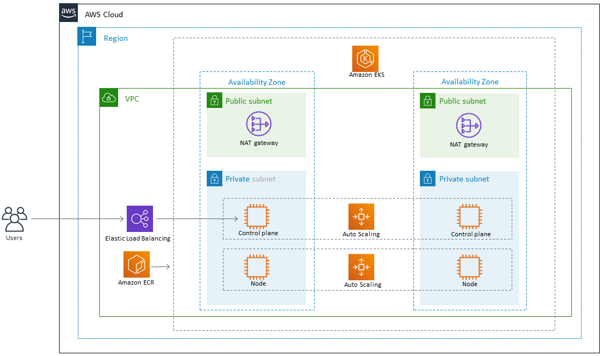

# DevOps with AWS & Kubernetes Challenge

This is the general approach I would use to deploy containerized apps in a EKS environments managed via ArgoCD deployments. I used multiple sources and Terraform modules to make development task a bit easier, even though this project has not been tested or deployed, so error will arise should you try to build/deploy it. Thanks.

### Setup

- Run init.bash
- When finished, run cleanup.bash 

### Requirements

- Terraform ~> 3.0
- AWS account
- Troubleshooting skills and...
- $$$ in your credit card :laughing:

### Diagram

### Sources
- https://docs.aws.amazon.com/prescriptive-guidance/latest/patterns/deploy-a-sample-java-microservice-on-amazon-eks-and-expose-the-microservice-using-an-application-load-balancer.html
- https://github.com/aws-samples/amazon-eks-argo-rollouts
- https://archive.eksworkshop.com/intermediate/290_argocd/install/